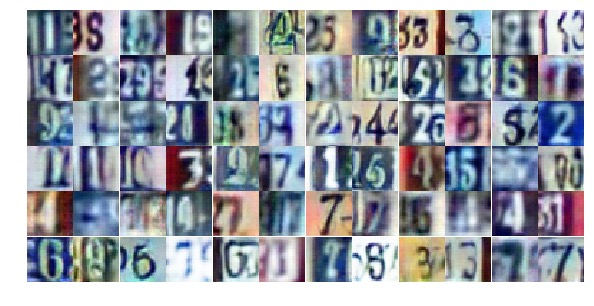

# DCGAN_SVHN
Deep Convolutional Generative Adversarial Network for Street View House Numbers dataset.



# Usage
```
git clone https://github.com/Meirtz/DCGAN_SVHN.git
cd ./DCGAN_SVHN
jupyter notebook DCGAN_SVHN.ipynb
```

# Prerequisites
**tensorflow** 1.0 or above

**jupyter**

# Acknowledgement
This is an assignment of Udacity DLND(Deep Learning NanoDegree program).

